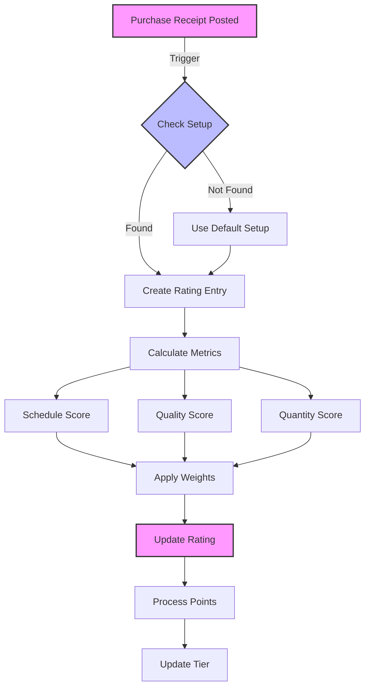
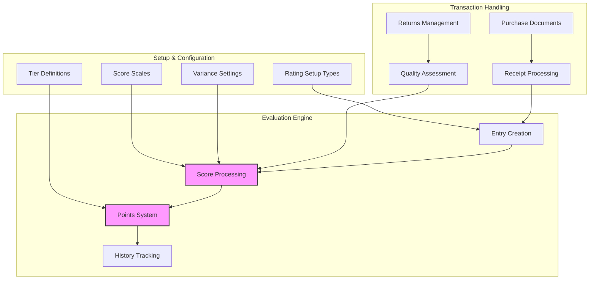

# Business Central Vendor Rating System

A comprehensive vendor performance management solution for Microsoft Dynamics 365 Business Central that enables automated vendor performance evaluation with multiple rating configurations, tier-based classification, and detailed performance tracking.

## Key Features

### Multiple Rating Configurations
- Support for different vendor types (Default, Manufacturing, Services, Supplies)
- Customizable evaluation criteria per setup
- Configurable weights for performance metrics
- Flexible minimum order requirements
- Industry-specific scoring scales

### Performance Metrics
- **Schedule Performance**: Measures delivery timeliness and adherence to expected dates
- **Quality Performance**: Tracks returns and quality issues through return order analysis
- **Quantity Performance**: Evaluates order accuracy and quantity variances
- **Weighted Scoring**: Customizable importance of each metric per vendor type

### Document Management & Tracking
- Full integration with BC purchase documents
- Direct navigation between related documents
- Order and receipt number tracking
- Complete purchase history accessibility

### Automated Evaluation System

### Tier Management System
- Dynamic tier progression (Bronze to Platinum)
- Points-based advancement
- Customizable tier thresholds per setup
- Priority level management
- Automated notifications for tier changes

### Performance Analytics

## Implementation Guide

### Prerequisites
- Microsoft Dynamics 365 Business Central 2022 Wave 2 or later
- Purchase order management setup
- Vendor master data setup

### Initial Setup
1. Deploy the extension
2. Navigate to Vendor Rating Setup
3. Run Initialize Setup action for default configurations
4. Configure additional rating setups as needed:
   - Manufacturing
   - Services
   - Supplies
5. Review and adjust:
   - Rating scales per setup
   - Delivery variance tolerances
   - Quantity variance allowances
   - Tier requirements and thresholds

### Vendor Configuration
1. Access Vendor Card
2. Assign appropriate Rating Setup Code
3. Review initial tier assignment
4. Configure vendor-specific parameters

## System Integration

### Standard BC Integration Points
- Purchase Order Management
- Receipt Processing
- Return Order Handling
- Vendor Management

### Enhanced User Interface
- Extended Vendor Card with rating information
- Dynamic Rating FactBox
- Comprehensive Rating History
- Interactive Setup Cards
- Performance Analytics Dashboards

## Usage Guidelines

### Daily Operations
- Automatic rating calculation on receipt posting
- Direct document navigation from rating entries
- Real-time performance monitoring
- Instant tier status updates

### Performance Monitoring
- Track vendor scores across all metrics
- Monitor trend indicators
- Review point accumulation
- Analyze tier progression

### Document Navigation
- Direct access to related purchase orders
- Quick view of posted receipts
- Integrated return order tracking
- Complete transaction history

## Technical Requirements
- Business Central 2022 Wave 2 or later
- Standard user permissions for setup
- Appropriate security roles for rating management

## Support and Maintenance
For technical support and feature requests:
- Submit detailed issue reports
- Include setup configurations
- Provide specific scenario examples
- Document version information

## License
This project is licensed under the MIT License - see LICENSE file for details.

## Contributing
We welcome contributions! Please:
1. Fork the repository
2. Create a feature branch
3. Submit a pull request with detailed changes
4. Include relevant test cases
5. Update documentation as needed

## Version History
- Current: Multiple rating setup support, enhanced document navigation
- Previous: Single rating configuration, basic scoring system