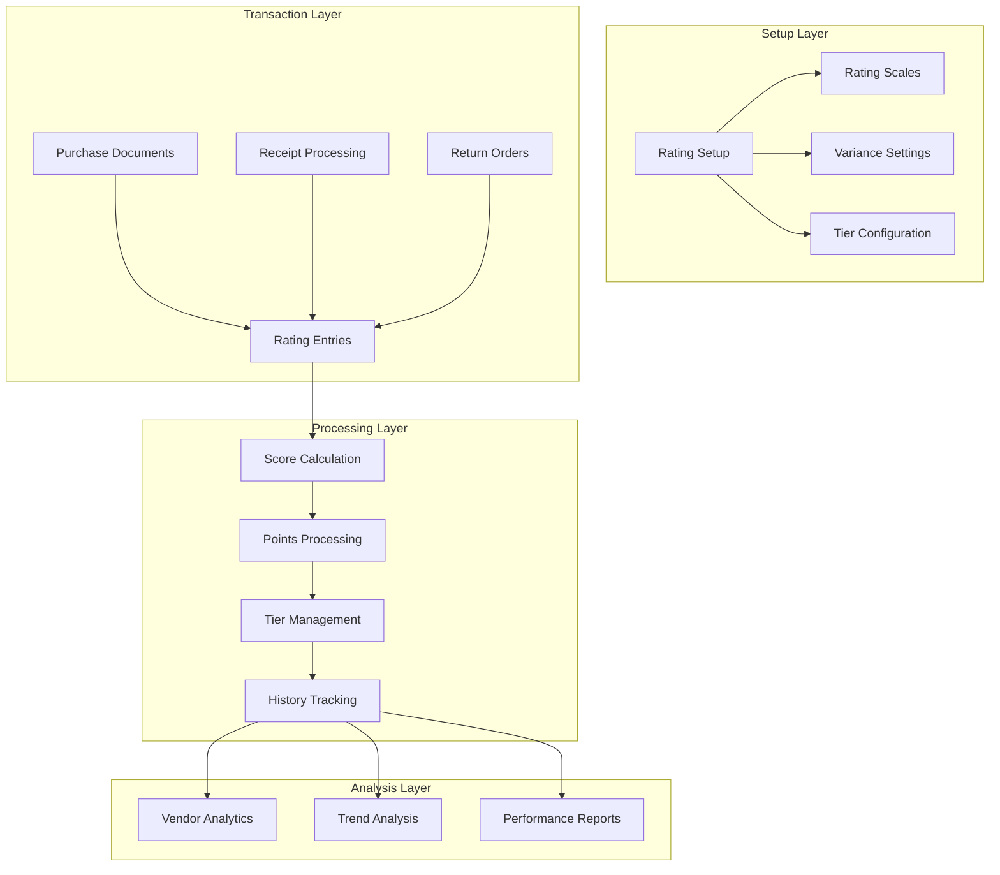

# Business Central Vendor Rating System

## Overview
A comprehensive vendor performance management solution for Microsoft Dynamics 365 Business Central that automates vendor evaluation through configurable rating systems, tier-based classifications, and detailed analytics. The system seamlessly integrates with existing procurement workflows to provide real-time insights into vendor performance.

## Core Features

### Multi-Configuration Rating Framework
- **Industry-Specific Setups**: Pre-configured templates for Manufacturing, Services, and Supplies
- **Customizable Evaluation Criteria**: Flexible weighting system for different performance metrics
- **Dynamic Scoring Models**: Configurable scoring scales and thresholds per setup type
- **Automated Setup Management**: Initialize and maintain rating configurations through user-friendly interfaces

### Performance Metrics & Scoring
- **Schedule Performance**: 
  - Automated delivery timeline tracking
  - Configurable variance thresholds
  - Early/late delivery scoring matrices
  
- **Quality Assessment**:
  - Quality score capture during receipt posting
  - Return order analysis and tracking
  - Integrated quality metrics calculation
  
- **Quantity Accuracy**:
  - Order vs. receipt variance tracking
  - Configurable tolerance levels
  - Automated scoring based on accuracy

### Advanced Tier Management
- **Dynamic Tier System**:
  - Automated progression through Bronze, Silver, Gold, and Platinum tiers
  - Points-based advancement with configurable thresholds
  - Industry-specific tier requirements
  
- **Performance Tracking**:
  - Real-time point accumulation
  - Progress tracking toward next tier
  - Historical performance analysis

### Business Central Integration
- **Document Processing**:
  - Automated rating entry creation on purchase receipt posting
  - Quality score capture during receipt processing
  - Return order integration for quality metrics
  
- **UI Enhancements**:
  - Enhanced Vendor Card with rating information
  - Interactive Rating FactBox
  - Performance analytics dashboard
  - Drill-down capabilities for detailed analysis

## Technical Architecture

### Core Components


### Key Codeunits
- **Rating Management**: Core setup and configuration handling
- **Rating Calculation**: Performance metric computation
- **Rating Data Management**: Data processing and history tracking
- **Vendor Tier Management**: Tier progression and points system
- **Quality Score Handler**: Quality metric capture and processing

## Setup Guide

### Prerequisites
- Microsoft Dynamics 365 Business Central 2022 Wave 2 or later
- Standard procurement module configuration
- Appropriate user permissions

### Initial Configuration
1. **Base Setup**
   ```
   Rating Management -> Initialize Setup
   ```
   - Creates default configuration
   - Establishes rating scales
   - Sets up variance tolerances
   - Initializes tier structure

2. **Industry Configuration**
   - Navigate to Vendor Rating Setup
   - Select or create industry-specific setup
   - Configure weights and thresholds
   - Define tier requirements

3. **Vendor Assignment**
   - Open Vendor Card
   - Assign appropriate Rating Setup Code
   - Review initial tier placement
   - Configure vendor-specific parameters

## User Guide

### Daily Operations
1. **Purchase Receipt Processing**
   - System automatically creates rating entry
   - Quality score prompt appears
   - Scores calculate automatically
   - Tier updates process in real-time

2. **Performance Monitoring**
   - Use Vendor Rating FactBox for quick insights
   - Review detailed history through drill-down
   - Track progress toward next tier
   - Monitor trend indicators

3. **Analysis and Reporting**
   - Access vendor performance dashboard
   - Review historical trends
   - Export data for detailed analysis
   - Generate performance reports

## Development Guide

### Extension Structure
```
├── src/
│   ├── Pages/
│   │   ├── VendorRatingSetup
│   │   ├── RatingFactBox
│   │   └── PerformanceAnalytics
│   ├── Tables/
│   │   ├── RatingSetup
│   │   ├── RatingEntry
│   │   └── RatingHistory
│   ├── Codeunits/
│   │   ├── RatingManagement
│   │   ├── RatingCalculation
│   │   └── TierManagement
│   └── Enums/
│       ├── RatingType
│       └── TrendIndicator
```

### Best Practices
- Implement event subscribers for document posting
- Use table relations for data integrity
- Leverage BC's built-in permission system
- Follow AL coding standards
- Implement proper error handling

## Troubleshooting

### Common Issues
1. **Rating Not Calculating**
   - Verify setup initialization
   - Check minimum order requirements
   - Validate setup code assignment

2. **Tier Not Updating**
   - Review points calculation
   - Check tier thresholds
   - Verify rating entry creation

3. **Performance Issues**
   - Monitor database indexes
   - Review calculation triggers
   - Check data archival settings

## Support and Maintenance

### Version Control
- GitHub repository for source code
- Semantic versioning for releases
- Detailed changelog maintenance

### Support Channels
- Issue tracking through GitHub
- Technical documentation wiki
- Community forum participation

## License
Licensed under the MIT License - see LICENSE file for details.

## Contributing Guidelines
1. Fork the repository
2. Create feature branch
3. Follow coding standards
4. Include unit tests
5. Submit pull request

## Roadmap
- Advanced analytics dashboard
- AI-powered scoring predictions
- Vendor benchmarking
- Mobile app integration
- API expansion for external systems

For technical support, feature requests, or bug reports, please submit detailed information through our GitHub issue tracker.