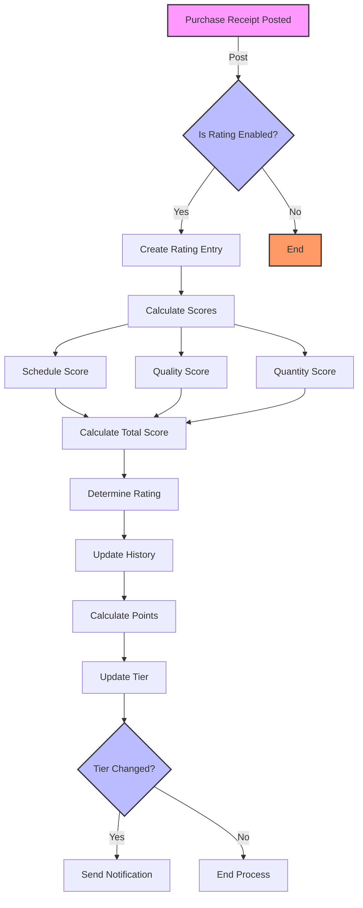
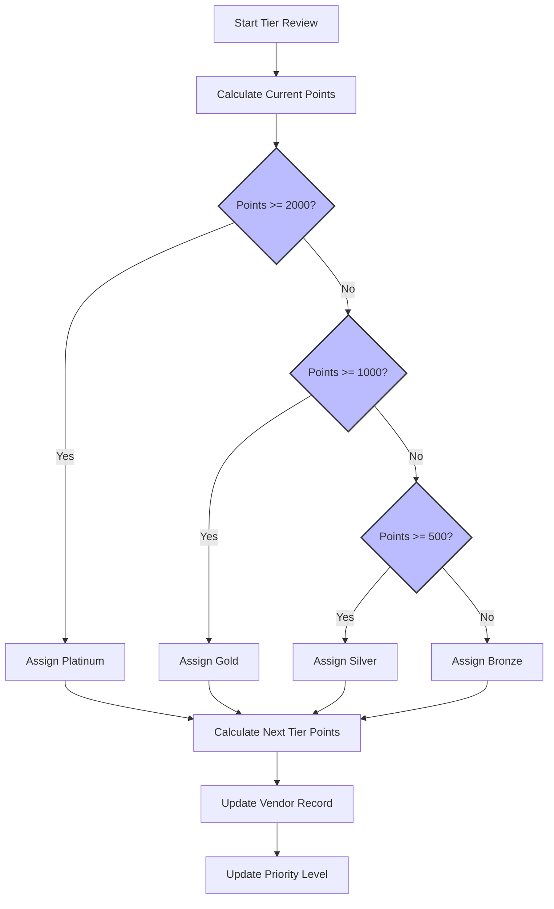
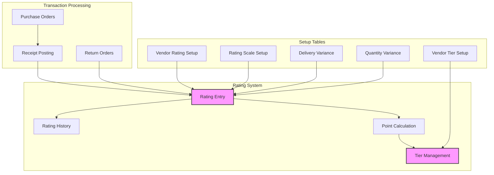

# Business Central Vendor Rating System

A comprehensive vendor performance management solution for Microsoft Dynamics 365 Business Central that enables automated vendor rating, tier-based classification, and performance tracking.

## Process Flows

### Rating Calculation

### Tier Assignment

### System Components

## Features
- Automated vendor performance rating
- Tier-based vendor classification (Bronze to Platinum)
- Points accumulation system
- Performance history tracking
- Automated tier progression
- Priority level management

## Setup
1. Deploy the extension to your Business Central environment
2. Open Vendor Rating Setup
3. Run Initialize Setup
4. Configure rating scales and variances
5. Set up vendor tiers
6. Begin rating calculations

## Usage
- Ratings are automatically calculated on receipt posting
- Tiers are updated based on point accumulation
- View vendor performance in Vendor Card
- Track progression through tier system
- Monitor vendor statistics in factbox

## Technical Requirements
- Microsoft Dynamics 365 Business Central
- Compatible with 2022 Wave 2 and later

## Contributing
Contributions welcome! Please read the contributing guidelines before submitting pull requests.

## License
MIT License

## Support
For issues and feature requests, please use the GitHub issue tracker.
